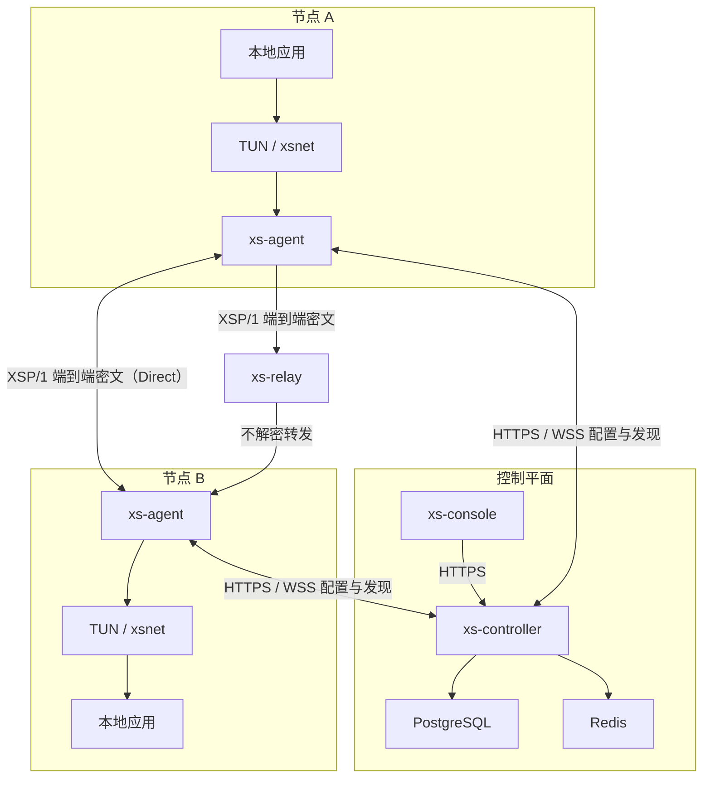

# 拾枢（XS Nexus）总体架构

状态：M3.1 已同步 ACL、IPAM 和路由冲突实现
日期：2026-07-31
安全结论：本设计尚未经过独立第三方审计，不代表生产级安全。

## 1. 架构原则

1. Controller 管理身份、地址、策略和发现，不进入普通业务数据路径；
2. Agent 在端点完成身份验证、加密、解密、ACL、路由和路径选择；
3. Direct 优先，Relay 只转发端到端密文；
4. Linux 网络操作使用 TUN 与 Netlink，Windows 内核只保留最小虚拟 NIC 和受控 IPC；
5. 默认拒绝、配置签名、版本单调和节点身份绑定是系统不变量；
6. 所有宿主机网络变更必须限定到项目资源、可验证且可恢复；
7. 控制器短时离线不能立即中断已建立的数据会话；
8. 任何单个 Relay 均不能获得业务明文或应用会话密钥。

## 2. 逻辑组件

| 组件 | 责任 | 明确不负责 |
|---|---|---|
| `xs-controller` | 注册、凭证、IPAM、节点目录、策略、配置版本、审计、更新元数据 | 普通业务转发、节点私钥托管 |
| `xs-agent` | TUN、Netlink、控制连接、握手、数据加密、ACL、路径选择、诊断 | 管理员 UI、全局身份签发 |
| `xs-relay` | 认证后的密文转发、限速、会话和队列管理、健康指标 | 解密、业务 ACL 决策、保存业务密钥 |
| `xs-cli` | 本地状态、诊断、路径、路由和安全清理入口 | 绕过 Agent 权限边界 |
| `xs-console` | 管理员工作流和真实 API 状态展示 | 持有节点私钥、仅靠前端实施权限 |
| `xsnet` | Windows 虚拟 NIC 与受控用户态 IPC | 密码学、NAT、ACL、Relay、复杂路由 |
| `xsp-core` | XSP/1 编码、状态机、密钥派生调用、重放保护 | 自行实现密码学原语 |
| `xsp-lab` | namespace、NAT、故障和攻击实验 | 替代真实设备最终验收 |

更新控制面把离线签名发布、网络/通道/平台/架构灰度策略和节点签名运行时上报保存在 PostgreSQL。Controller 只持有离线发布公钥并决定资格；Agent 和受限 root helper 都必须重新验证清单、签名和归档，实际切换复用 Linux 安装器的原子升级/回滚事务。节点通道属于 Controller 签名配置，不能由未签名的在线指令单独改变。详细边界见 `docs/UPDATE_SYSTEM.md`。

## 3. 数据和控制流

### 3.1 注册

1. 管理员创建一次性 Enrollment Token；
2. Agent 在本地生成长期身份密钥；
3. Agent 通过 TLS 提交公钥、设备声明和 Token；
4. Controller 验证 Token 哈希、次数和有效期；
5. IPAM 分配稳定虚拟 IP；
6. Controller 签发绑定网络、节点、公钥、地址、序列和有效期的节点凭证；
7. Agent 将私钥和凭证写入本机受限存储；
8. Controller 只保存公钥、凭证元数据和吊销状态。

### 3.2 已注册节点发现

Controller 下发签名、单调递增的配置快照或增量，内容包含节点公钥、凭证状态、虚拟 IP、候选端点、Relay 列表和策略。Agent 只有在签名正确、网络一致且版本严格递增时才替换最近有效配置。

### 3.3 业务数据

1. Agent 从 TUN 读取三层 IP 包；
2. 校验源虚拟 IP、目标虚拟 IP、路由和发送端 ACL；
3. 选择或建立目标节点会话；
4. XSP/1 使用方向独立密钥、Epoch 和序列号封装整个 IP 包；
5. 优先经 Direct UDP 发送，失败时使用 Relay envelope 转发相同端到端密文；
6. 接收端验证包头、会话、Epoch、重放窗口、AEAD 和接收端 ACL；
7. 验证通过后才写入 TUN。

## 4. 部署边界

### 4.1 Docker

- `xs-controller`；
- `xs-relay`；
- `xs-console`；
- 普通 worker 和 QA 服务。

所有服务默认非 root、只读根文件系统、删除全部 capability 后按需增加最小权限。Compose 只引用外部 `1panel-network`，不创建数据库容器，不发布数据库端口。

### 4.2 宿主机 systemd

- `xs-agent`；
- TUN 与 Netlink；
- 项目 network namespace 实验协调；
- 需要真实宿主机网络能力的测试。

Agent 以最小 capability 运行。初始化阶段可由受控 helper 完成接口和路由操作，长期进程不默认保留完整 root 权限。

## 5. 信任边界

| 边界 | 输入视为 | 主要控制 |
|---|---|---|
| Internet → Controller | 不可信 | TLS、认证、速率限制、输入验证、审计 |
| Internet → Relay | 不可信 | 节点认证、会话绑定、限速、无放大 |
| Peer Agent → Agent | 恶意或被攻陷 | 凭证、签名、状态机、AEAD、重放、ACL |
| Controller → Agent | 高权限但可能被攻陷 | 配置签名、版本单调、范围约束、最后有效配置 |
| Relay → Agent | 不可信 | 端到端 AEAD，不接受 Relay 提供身份结论 |
| TUN / xsnet → Agent | 本机不可信输入 | 包长、IP 版本、源地址和路由验证 |
| Console → Controller | 管理员但可能越权 | 后端 RBAC、CSRF、审计、高风险确认 |
| Agent → OS 网络 | 高风险系统操作 | 项目命名、状态快照、幂等回滚、默认路由保护 |

## 6. 状态存储

### Controller

PostgreSQL 保存用户、网络、节点、公钥、凭证元数据、Token 哈希、IPAM、策略、路由审批、配置版本和审计。Redis 只保存在线状态、短期协调、限速和可重建缓存，不是身份或策略事实来源。

### Agent

本地保存长期私钥、节点凭证、Controller 信任根、最近有效配置、当前配置版本和恢复所需的项目网络状态。会话密钥仅驻留内存，退出时清零。

签名配置中的节点目录、组、标签和 ACL 在替换前统一验证并编译。规则按优先级降序、同优先级 ID 升序执行首次匹配；无匹配、未知源和未知目标默认拒绝。发送端在加密前执行，接收端在认证解密后再次执行，并将 XSP/1 会话 Peer 身份与内层源虚拟 IP 绑定。任何签名、版本、网络、节点或策略错误都保留最近有效配置。

### Relay

只保存短期认证转发 Lease、Network/Node/Relay 路由标识、绑定 UDP 端点、每 Lease 重放窗口、限速计数、短队列和聚合指标。注册由 Controller 节点凭证与节点身份签名认证；Relay 使用独立身份密钥签发最多 300 秒的 Lease。不得保存节点长期私钥、XSP/1 业务会话密钥、解密后的虚拟 IP 包或业务载荷。

XSR/1 Data envelope 仅包裹完整内层 XSP/1 datagram。Relay 必须逐字节转发，不解密、不重新加密、不替 Agent 认证 Peer，也不执行业务 ACL。匿名、过期 Lease、错误来源端点、重放、目标无活动 Lease和超限报文静默丢弃。

## 7. 故障行为

| 故障 | 预期行为 |
|---|---|
| Controller 短时不可用 | 已建立数据会话和最近有效策略继续；注册、吊销和新配置暂停 |
| PostgreSQL 不可用 | Controller 停止写操作并报告不健康，不回退到不一致内存状态 |
| Redis 不可用 | 降级可重建短期能力，不丢失身份、策略和审计事实 |
| Relay 不可用 | Agent 尝试其他 Relay 和 Direct，记录切换原因 |
| Direct 路径变化 | 认证探测重新选择路径，业务会话按迁移规则续用或安全重建 |
| Agent 崩溃 | systemd 重启；启动时核对并恢复项目接口与路由，不修改默认路由 |
| 配置签名或版本错误 | 拒绝新配置，保留最近有效配置并记录安全事件 |
| 时钟异常 | 不以时间作为唯一反重放依据；凭证验证进入明确受限状态 |

## 8. 网络变更恢复

Agent 必须维护项目资源清单：接口名、ifindex、地址、route、rule、nftables table/chain、namespace 和 qdisc。清理只删除同时满足项目标识和记录一致性的资源。任何默认路由或非项目资源冲突都必须失败关闭并保留诊断。

## 9. 可观测性

日志使用稳定错误码和结构化字段，不记录 Token、Cookie、私钥、会话密钥或业务内容。指标区分 Direct、Relay、握手、重放、AEAD、ACL、配置版本、路由和恢复事件。诊断包默认脱敏公网地址并排除秘密文件。

## 10. 实施顺序

1. M1.1：Controller 注册、IPAM、配置签名和审计；
2. M1.2：Linux Agent、TUN、Netlink 和本地安全存储；
3. M1.3：XSP/1 双节点加密数据通路；
4. M2：候选、打洞、Relay 和路径恢复；
5. M3：双端 ACL、IPAM 完整化和子网路由；
6. M4–M5：真实控制台和生命周期；
7. M6：Windows 驱动与 Agent，实机验收受外部门禁；
8. M7–M9：缺陷、安全、性能和 Release Candidate。
