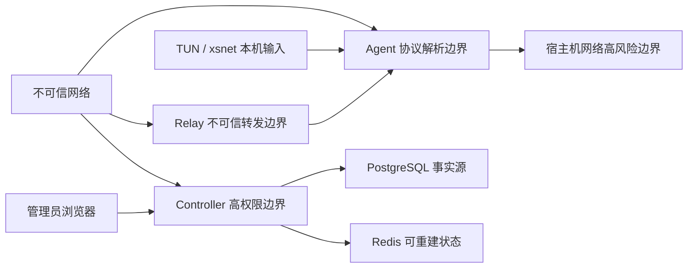

# 威胁模型

状态：M0.2 初始模型  
日期：2026-07-29  
范围：Controller、Agent、Relay、Console、Linux TUN/Netlink、Windows `xsnet`、安装更新和 1Panel 部署。

## 1. 安全目标

- 只有有效网络成员才能建立节点会话；
- 节点身份、网络身份、虚拟 IP 和数据包源地址不可分离；
- 业务载荷在端点之间机密、完整且抗重放；
- Relay 和网络中间人不能解密或伪造业务包；
- 配置和策略必须签名、版本单调且默认拒绝；
- Controller 短时离线时已建立连接继续，但新授权不能绕过；
- 宿主机默认路由、SSH 和无关 1Panel 资源不被项目破坏；
- 更新、安装和卸载不能绕过签名或留下项目网络残留；
- 秘密不进入 Git、日志、前端、诊断、崩溃转储或构建产物。

## 2. 关键资产

1. Controller 凭证签名私钥和配置签名私钥；
2. 节点长期 Ed25519 私钥；
3. XSP/1 临时私钥、握手密钥和业务流量密钥；
4. Enrollment Token、管理员会话和恢复材料；
5. 网络成员关系、虚拟 IP、ACL 和子网路由；
6. 更新离线签名私钥和发布清单；
7. 审计日志与数据库备份；
8. Windows 驱动信任和 Agent/驱动 IPC；
9. 宿主机路由、防火墙、TUN、namespace 和 1Panel 资源。

## 3. 威胁主体

- 未认证公网攻击者；
- 中间人、重放者和流量观察者；
- 恶意或被攻陷的已注册节点；
- 不可信或被攻陷的 Relay；
- 被攻陷的 Controller；
- 恶意或越权管理员；
- 泄露 Enrollment Token 的持有者；
- 本地低权限用户和恶意进程；
- 软件供应链攻击者；
- 恶意驱动输入和异常设备生命周期；
- 资源耗尽和反射放大攻击者。

## 4. 信任边界

## 5. 安全不变量

- Controller 不保存节点私钥；
- Relay 不持有业务密钥；
- 同一密钥下 nonce 不复用；
- 每方向独立密钥、序列和重放窗口；
- 未通过 AEAD 和身份/地址检查的数据包不进入 TUN；
- 配置版本不能回退；
- 未审批子网不能发布；
- 发送端和接收端都执行 ACL；
- 默认路由不能由常规虚拟网络配置覆盖；
- 未认证报文不得触发大于输入的响应；
- 任何秘密不得记录到可持久化日志。

## 6. 威胁与控制

| ID | 威胁 | 影响 | 主要控制 | 剩余风险 |
|---|---|---|---|---|
| T01 | Token 被窃取或重复使用 | 未授权节点注册 | 只存哈希、有效期、次数、范围、原子消费、审计 | Token 在有效窗口内仍是 bearer secret |
| T02 | 恶意节点伪造另一节点 | 越权访问 | Controller 签名凭证、Ed25519 身份签名、Node ID 绑定 | 被攻陷节点可滥用自身权限 |
| T03 | 伪造源虚拟 IP | ACL 绕过 | 会话身份与源 IP 绑定，双端检查 | 配置错误可能扩大合法权限 |
| T04 | 握手中间人 | 会话劫持 | 临时 X25519、双方签名、完整 transcript、网络/版本绑定 | 协议组合需第三方审计 |
| T05 | 降级攻击 | 弱算法或旧协议 | v1 固定套件、选择结果进入签名 transcript、未知版本拒绝 | 未来多套件增加复杂度 |
| T06 | 数据重放或乱序滥用 | 重复操作、资源耗尽 | 每 Epoch 1024 位窗口、64 位序列、先做廉价边界检查 | 大量随机包仍消耗解析资源 |
| T07 | AEAD 篡改 | 明文注入 | 包头作为 AAD、常量时间 Tag 验证、失败静默丢弃 | 错误统计本身需限速 |
| T08 | Relay 解密或伪造 | 数据泄露/注入 | 端到端 XSP/1 密文，Relay envelope 与内层身份分离 | Relay 可观察有限元数据和实施 DoS |
| T09 | Relay 反射放大 | 第三方 DDoS | 认证会话、无匿名转发、响应不大于请求、限速和配额 | 分布式认证节点仍可消耗资源 |
| T10 | 配置回滚或伪造 | 恢复旧权限 | 配置签名、单调版本、最近有效配置、回滚审计 | Controller 签名密钥被攻陷时需紧急根轮换 |
| T11 | 恶意路由发布 | 流量劫持 | 管理员审批、冲突检测、网关角色、默认路由保护 | 恶意已批准网关可观察其转发流量 |
| T12 | Controller 被攻陷 | 身份/策略控制失守 | 密钥分层、审计、最小权限、离线更新根、吊销和恢复流程 | 在线签名密钥被盗仍是高影响事件 |
| T13 | 数据库/Redis 暴露 | 凭据攻击、数据泄露 | 仅容器网络、最小用户、无公网端口、TLS/认证、备份 | 当前环境存在 KI-006，最终验收受阻 |
| T14 | 日志或诊断泄密 | 长期秘密外泄 | 结构化允许列表、脱敏、秘密类型禁止序列化、测试扫描 | 第三方库错误日志需持续审查 |
| T15 | 本地低权限进程控制 Agent | 身份盗用 | Unix socket/Named Pipe ACL、peer credential、专用用户、私钥 0600 | root/管理员可完全控制节点 |
| T16 | 更新供应链篡改 | 远程代码执行 | 离线根签名、清单签名、哈希、平台/版本绑定、防回滚 | 构建基础设施被攻陷需可追溯构建和重建 |
| T17 | Windows 驱动边界错误 | 提权、蓝屏 | 最小 IOCTL、长度/整数/生命周期验证、Driver Verifier、VM 快照 | 未完成实机测试前不可发布 |
| T18 | 路由或防火墙错误 | SSH 失联、流量劫持 | 基线、自动回滚、项目命名、第二会话、默认路由保护 | 内核/发行版差异需真实矩阵 |
| T19 | 时钟回拨 | 过期凭证继续或新凭证拒绝 | 单调配置版本、nonce/replay 独立于时间、受限时钟故障模式 | 大幅时钟错误会阻塞新握手 |
| T20 | 资源耗尽 | 服务不可用 | 报文长度上限、会话配额、无状态预检、队列和速率限制 | 大规模 DDoS 仍需云侧缓解 |

## 7. 关键滥用场景

### 7.1 被吊销节点保持旧会话

Controller 下发单调吊销版本；Agent 在允许的最短窗口内终止关联会话。Controller 离线时不能无限延长高风险凭证，凭证自身有效期和本地吊销缓存共同限制窗口。

### 7.2 恶意节点发布 `0.0.0.0/0`

Controller 默认拒绝默认路由，只有未来明确启用 Exit Node 功能并经过独立高风险审批才可接受。M3.2 的普通子网路由必须拒绝 `/0`、本机管理网段和与系统路由冲突的前缀。

### 7.3 Relay 返回伪造路径成功

Agent 不接受 Relay 对节点身份或内层包有效性的声明。只有对端完成 XSP/1 握手和 AEAD 验证后路径才进入可用状态。

### 7.4 Controller 下发低版本配置

Agent 比较持久化的最后版本并拒绝低版本、同版本不同哈希和无签名配置；拒绝时继续使用最近有效配置并生成安全事件。

## 8. 测试映射

| 控制 | 必测证据 |
|---|---|
| 身份与 transcript | 正常握手、签名错误、节点/网络/版本篡改 |
| 抗重放 | 重复包、窗口边界、旧/未来 Epoch、乱序 |
| AEAD | Tag 篡改、AAD 字段篡改、随机密文 |
| ACL 与源绑定 | 双端拒绝、源 IP 伪造、旧策略和无签名策略 |
| Relay | 匿名拒绝、限速、无明文、故障切换和 Direct 回切 |
| 主机恢复 | Agent 崩溃、卸载、默认路由不变、项目规则无残留 |
| 更新 | 清单篡改、哈希错误、版本回滚、失败恢复 |
| 驱动 | IOCTL Fuzz、Driver Verifier、睡眠、反复安装卸载 |
| Web | RBAC、CSRF、XSS、注入、会话过期、错误脱敏 |
| 供应链 | 锁文件、SBOM、依赖审计、签名和构建来源 |

## 9. 不在安全承诺内

- 被 root、SYSTEM 或设备管理员完全攻陷的端点；
- 端点业务应用自身的明文和漏洞；
- 全球级流量分析和强制断网；
- 尚未完成的第三方协议、密码学和驱动审计；
- 未经用户门禁完成的真实 NAS、Windows VM、DNS、正式签名和生产防火墙。

## 10. 审查触发条件

协议字段、密码套件、凭证、路由权限、Relay envelope、更新签名、驱动 IPC 或信任根发生变化时，必须同步更新本文件、协议规范、测试向量和安全假设。
