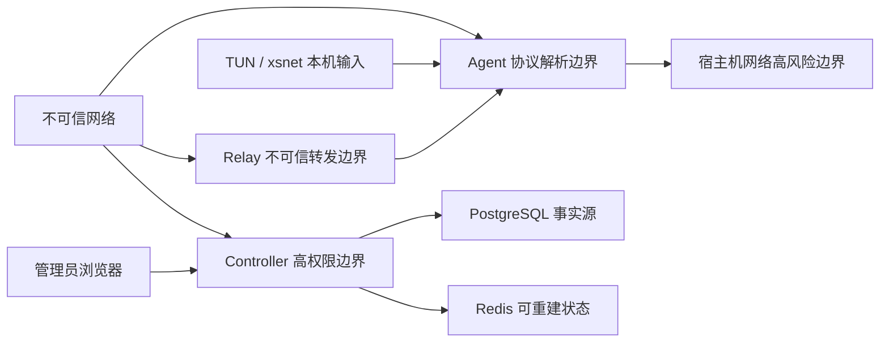

# 威胁模型

状态：M3.1 已同步默认拒绝 ACL、双端执行、IPAM 冷却和路由冲突控制
日期：2026-07-31
范围：Controller、Agent、Relay、Console、Linux TUN/Netlink、Windows `xsnet`、安装更新和 1Panel 部署。

## 1. 安全目标

- 只有有效网络成员才能建立节点会话；
- 节点身份、网络身份、虚拟 IP 和数据包源地址不可分离；
- 业务载荷在端点之间机密、完整且抗重放；
- Relay 和网络中间人不能解密或伪造业务包；
- 配置和策略必须签名、版本单调且默认拒绝；
- Controller 短时离线时已建立连接继续，但新授权不能绕过；
- 宿主机默认路由、SSH 和无关 1Panel 资源不被项目破坏；
- 更新、安装和卸载不能绕过签名或留下项目网络残留；
- 秘密不进入 Git、日志、前端、诊断、崩溃转储或构建产物。

## 2. 关键资产

1. Controller 凭证签名私钥和配置签名私钥；
2. 节点长期 Ed25519 私钥；
3. XSP/1 临时私钥、握手密钥和业务流量密钥；
4. Enrollment Token、管理员会话和恢复材料；
5. 网络成员关系、虚拟 IP、ACL 和子网路由；
6. 更新离线签名私钥和发布清单；
7. 审计日志与数据库备份；
8. Windows 驱动信任和 Agent/驱动 IPC；
9. 宿主机路由、防火墙、TUN、namespace 和 1Panel 资源。

## 3. 威胁主体

- 未认证公网攻击者；
- 中间人、重放者和流量观察者；
- 恶意或被攻陷的已注册节点；
- 不可信或被攻陷的 Relay；
- 被攻陷的 Controller；
- 恶意或越权管理员；
- 泄露 Enrollment Token 的持有者；
- 本地低权限用户和恶意进程；
- 软件供应链攻击者；
- 恶意驱动输入和异常设备生命周期；
- 资源耗尽和反射放大攻击者。

## 4. 信任边界

## 5. 安全不变量

- Controller 不保存节点私钥；
- Relay 不持有业务密钥；
- 同一密钥下 nonce 不复用；
- 每方向独立密钥、序列和重放窗口；
- 未通过 AEAD 和身份/地址检查的数据包不进入 TUN；
- 配置版本不能回退；
- 未审批子网不能发布；
- 发送端和接收端都执行 ACL；
- 默认路由不能由常规虚拟网络配置覆盖；
- 未认证报文不得触发大于输入的响应；
- 未认证发现请求不得获得观察端点响应；
- 未经节点签名和 Controller 重新签名的候选不得进入 Peer 配置；
- 新 UDP 端点不得在握手或 AEAD 路径证明前晋升；
- 任何秘密不得记录到可持久化日志。

## 6. 威胁与控制

| ID | 威胁 | 影响 | 主要控制 | 剩余风险 |
|---|---|---|---|---|
| T01 | Token 被窃取或重复使用 | 未授权节点注册 | 只存哈希、有效期、次数、范围、原子消费、审计 | Token 在有效窗口内仍是 bearer secret |
| T02 | 恶意节点伪造另一节点 | 越权访问 | Controller 签名凭证、Ed25519 身份签名、Node ID 绑定 | 被攻陷节点可滥用自身权限 |
| T03 | 伪造源虚拟 IP | ACL 绕过 | 会话身份与源 IP 绑定，双端检查 | 配置错误可能扩大合法权限 |
| T04 | 握手中间人 | 会话劫持 | 临时 X25519、双方签名、完整 transcript、网络/版本绑定 | 协议组合需第三方审计 |
| T05 | 降级攻击 | 弱算法或旧协议 | v1 固定套件、选择结果进入签名 transcript、未知版本拒绝 | 未来多套件增加复杂度 |
| T06 | 数据重放或乱序滥用 | 重复操作、资源耗尽 | 每 Epoch 1024 位窗口、64 位序列、先做廉价边界检查 | 大量随机包仍消耗解析资源 |
| T07 | AEAD 篡改 | 明文注入 | 包头作为 AAD、常量时间 Tag 验证、失败静默丢弃 | 错误统计本身需限速 |
| T08 | Relay 解密或伪造 | 数据泄露/注入 | XSR/1 只转发逐字节不变的端到端 XSP/1 密文；Agent 独立验证握手、AEAD、Epoch、重放和 ACL | Relay 可观察有限元数据并实施丢包、延迟、重复、重排或 DoS |
| T09 | Relay 反射放大 | 第三方 DDoS | 节点凭证和身份签名注册、随机短期 Lease、来源端点绑定、目标活动 Lease、转发不增大、匿名失败静默丢弃、限速和配额 | 分布式有效节点或获得活动 Lease 的 on-path 攻击者仍可消耗受限容量 |
| T10 | 配置回滚或伪造 | 恢复旧权限 | 配置签名、单调版本、最近有效配置、回滚审计 | Controller 签名密钥被攻陷时需紧急根轮换 |
| T11 | 恶意路由发布 | 流量劫持 | 管理员审批、冲突检测、网关角色、默认路由保护 | 恶意已批准网关可观察其转发流量 |
| T12 | Controller 被攻陷 | 身份/策略控制失守 | 密钥分层、审计、最小权限、离线更新根、吊销和恢复流程 | 在线签名密钥被盗仍是高影响事件 |
| T13 | 数据库/Redis 暴露 | 凭据攻击、数据泄露 | 仅容器网络、最小用户、无公网端口、TLS/认证、备份 | 当前环境存在 KI-006，最终验收受阻 |
| T14 | 日志或诊断泄密 | 长期秘密外泄 | 结构化允许列表、脱敏、秘密类型禁止序列化、测试扫描 | 第三方库错误日志需持续审查 |
| T15 | 本地低权限进程控制 Agent | 身份盗用 | Unix socket/Named Pipe ACL、peer credential、专用用户、私钥 0600 | root/管理员可完全控制节点 |
| T16 | 更新供应链篡改 | 远程代码执行 | 离线根签名、清单签名、哈希、平台/版本绑定、防回滚 | 构建基础设施被攻陷需可追溯构建和重建 |
| T17 | Windows 驱动边界错误 | 提权、蓝屏 | 最小 IOCTL、长度/整数/生命周期验证、Driver Verifier、VM 快照 | 未完成实机测试前不可发布 |
| T18 | 路由或防火墙错误 | SSH 失联、流量劫持 | 基线、自动回滚、项目命名、第二会话、默认路由保护 | 内核/发行版差异需真实矩阵 |
| T19 | 时钟回拨 | 过期凭证继续或新凭证拒绝 | 单调配置版本、nonce/replay 独立于时间、受限时钟故障模式 | 大幅时钟错误会阻塞新握手 |
| T20 | 资源耗尽 | 服务不可用 | 报文长度上限、会话配额、无状态预检、队列和速率限制 | 大规模 DDoS 仍需云侧缓解 |
| T21 | 匿名地址发现反射 | 第三方 UDP 放大或端口扫描 | 固定长度节点凭证与身份签名、活动凭证数据库检查、响应小于请求、每来源速率限制、失败静默丢弃 | 分布式有效节点仍可制造受限请求负载 |
| T22 | 伪造或回滚候选广告 | 端点劫持、流量转向攻击者 | 已认证控制连接、节点身份签名、Network/Node 绑定、单调 generation、短过期、Controller 签名配置 | 被攻陷节点可重定向自身流量并实施 DoS |
| T23 | 伪造路径迁移 | 会话流量被引向攻击者或黑洞 | 新端点完成握手或 AEAD PathChallenge/PathResponse，来源端点、Path ID、token、序列和重放窗口全绑定 | 攻击者仍可丢弃或延迟探测报文 |

## 7. 关键滥用场景

### 7.1 被吊销节点保持旧会话

Controller 下发单调吊销版本；Agent 在允许的最短窗口内终止关联会话。Controller 离线时不能无限延长高风险凭证，凭证自身有效期和本地吊销缓存共同限制窗口。

### 7.2 恶意节点发布 `0.0.0.0/0`

Controller 默认拒绝默认路由，只有未来明确启用 Exit Node 功能并经过独立高风险审批才可接受。M3.2 的普通子网路由必须拒绝 `/0`、本机管理网段和与系统路由冲突的前缀。

### 7.3 Relay 返回伪造路径成功

Agent 不接受 Relay 对节点身份或内层包有效性的声明。XSR/1 Lease 只证明某节点向指定 Relay 完成过签名注册并保持短期 UDP 状态，不证明目标 Peer 或内层包有效。只有对端完成 XSP/1 握手或内层 AEAD 验证后路径才进入可用状态。

Relay Data envelope 不含业务密钥，也不逐包执行外层公钥签名；服务端必须把 Lease、Network、Source Node、UDP 来源端点、过期时间和独立 sequence 重放窗口作为一个不可拆分状态验证。攻击者即使观察或篡改外层元数据，也不能生成目标 Agent 接受的 XSP/1 明文，但仍可能造成受限 DoS，因此每节点带宽、包速率、队列和全局容量必须失败关闭。

### 7.4 Controller 下发低版本配置

Agent 比较持久化的最后版本并拒绝低版本、同版本不同哈希和无签名配置；拒绝时继续使用最近有效配置并生成安全事件。

### 7.5 未认证攻击者把发现服务作为反射器

Controller 只接受固定 334 字节、包含有效节点凭证和节点身份签名、时间新鲜且数据库状态活动的 XSD/1 Request。Response 固定 188 字节并绑定完整请求哈希；未知来源按 IP 限速，所有失败静默丢弃，因此匿名小包不能触发更大响应。

### 7.6 恶意节点发布另一节点的端点

候选广告必须通过该节点已认证控制连接发送，并以同一节点长期身份密钥签名精确 payload。Controller 比较控制连接的 Network ID、Node ID、公钥、generation 和端点冲突，拒绝跨节点占用、低 generation 和相同 generation 的不同内容。Peer 最终只消费 Controller 重新签名的配置。

### 7.7 攻击者伪造端点变化

未认证 UDP 源地址变化不会修改活动路径。已建立会话只对更高优先级候选发送 AEAD PathChallenge，并要求同一来源端点返回匹配 Path ID 和 8 字节 token 的 AEAD PathResponse；重放或来自其他端点的响应不能晋升路径。

## 8. 测试映射

| 控制 | 必测证据 |
|---|---|
| 身份与 transcript | 正常握手、签名错误、节点/网络/版本篡改 |
| 抗重放 | 重复包、窗口边界、旧/未来 Epoch、乱序 |
| AEAD | Tag 篡改、AAD 字段篡改、随机密文 |
| ACL 与源绑定 | 双端拒绝、源 IP 伪造、旧策略和无签名策略 |
| Relay | 匿名拒绝、限速、无明文、故障切换和 Direct 回切 |
| 地址发现 | 固定长度、凭证/身份签名、请求哈希绑定、响应小于请求、时间窗口、限速和篡改拒绝 |
| 候选与迁移 | 节点签名、generation 冲突、过期、优先级回退、AEAD PathChallenge/PathResponse 和 CLI 路径原因 |
| 主机恢复 | Agent 崩溃、卸载、默认路由不变、项目规则无残留 |
| 更新 | 清单篡改、哈希错误、版本回滚、失败恢复 |
| 驱动 | IOCTL Fuzz、Driver Verifier、睡眠、反复安装卸载 |
| Web | RBAC、CSRF、XSS、注入、会话过期、错误脱敏 |
| 供应链 | 锁文件、SBOM、依赖审计、签名和构建来源 |

### 8.1 M1.1 已实现证据

| 控制 | 自动化证据 |
|---|---|
| Enrollment Token 原子消费 | PostgreSQL 行锁、事务与并发双请求测试证明单次 Token 只成功一次 |
| IPAM 唯一分配 | 每网络事务 advisory lock、活动地址唯一约束、自动和管理员指定地址集成测试 |
| 节点凭证完整性 | 固定 200 字节向量、Ed25519 验签、全部 200 个单字节篡改位置拒绝 |
| 配置真实性与单调性 | 独立配置密钥签名精确 payload、Key ID 校验、版本递增和 WebSocket sync 测试 |
| 控制连接重放约束 | 每连接随机 challenge、10 秒认证窗口、节点身份签名和真实 loopback WebSocket 测试 |
| 审计不可变与脱敏 | 数据库 trigger 拒绝 UPDATE/DELETE，集成测试确认事件不含明文 Token |

M1.1 只实现 bootstrap 管理 Token，不代表最终 RBAC、浏览器会话、吊销传播或数据面协议已经完成。

### 8.2 M1.3 协议核心已实现证据

| 控制 | 自动化证据 |
|---|---|
| 标准原语调用 | RFC 7748 X25519、RFC 5869 HKDF-SHA-256、RFC 8439 ChaCha20-Poly1305 回归向量 |
| 身份与 transcript | 四消息 typestate 握手、双方 Ed25519 签名、Network/Node/Virtual IP/版本/套件/Session 绑定及篡改拒绝 |
| Key confirmation 与方向隔离 | ClientFinish/ServerFinish 双向 AEAD confirmation、独立方向 traffic secret/key/nonce salt |
| 数据真实性与源绑定 | 完整 96 字节头作为 AAD、Tag 篡改拒绝、IPv4 源/目标虚拟地址和分片拒绝 |
| 抗重放与轮换 | 每方向每 Epoch 1024 位窗口、AEAD 成功后提交、确认式单方向 Key Update、旧/当前 Epoch 乱序及显式退休 |
| 编码与 Fuzz seed | canonical session/data 向量以及 Magic、版本、类型、flag、长度、保留字段、截断、尾随字节和意外状态语料 |
| 秘密生命周期 | 临时 X25519、handshake 和 traffic secret 使用清零包装，Debug 输出不暴露秘密 |

M1.3 还通过两个隔离 Linux namespace 验证 Agent UDP/TUN 双节点链路、业务负载不可见、Tag 篡改、重放、伪造源地址、自动 Key Epoch 和 Controller 中断容错。该证据仍不代表长期 Fuzz、Relay 边界或第三方密码学审计已经完成。

### 8.3 M2.1 地址发现与候选管理已实现证据

| 控制 | 自动化证据 |
|---|---|
| 无匿名反射 | XSD/1 Request 334 字节、Response 188 字节；无效长度、凭证、签名、时间和数据库状态静默丢弃；每来源每分钟 30 次、最多跟踪 1024 个来源 |
| 请求与响应绑定 | Discovery 向量和协议测试验证 Network/Node/Request ID、完整请求 SHA-256、观察端点、时间和 Controller 签名 |
| 候选真实性与单调性 | 真实 Controller/PostgreSQL 测试覆盖节点签名、控制连接身份、generation 幂等重试、冲突拒绝、过期和配置重新签名 |
| 数据面端口一致 | namespace 测试用 nftables 计数证明 XSD/1 从同一 XSP/1 UDP socket 源端口发出 |
| 多候选回退 | 首选候选不可达时有界重试后使用下一候选，并由 CLI 报告 `handshake_fallback` |
| 认证路径晋升 | 已建立会话对更高优先级 veth 路径发送加密 PathChallenge，匹配响应后报告 `authenticated_path_probe`，双向 ICMP 持续通过 |

M2.1 全量证据位于 `/srv/xs-nexus/artifacts/qa/m2.1-20260729T175243Z`。隔离拓扑证据不等同于真实公网、全部 NAT 类型、运营商 IPv6 或移动网络切换验证；这些属于 M2.2 和外部环境矩阵。持续 Fuzz、Relay 边界和第三方密码学审计仍未完成。

### 8.4 M2.3 XSR/1 协议边界证据

| 控制 | 自动化证据 |
|---|---|
| 注册身份绑定 | 固定 352 字节请求同时验证 Controller 节点凭证、Network/Node/Relay/Request ID、时间和节点 Ed25519 签名 |
| 短期 Relay 身份 | 固定 168 字节响应由配置固定的 Relay 身份密钥签名，绑定原 Request ID、非零随机 Lease 和最多 300 秒有效期 |
| 域分离 | Register Request、Register Response 和 Keepalive Response 使用三个独立签名域，跨类型验证失败 |
| Canonical envelope | Data/Keepalive 严格验证 Magic、版本、类型、flag、长度、保留字段、非零标识、空 payload、自转发、截断和 1500 字节上限 |
| 向量与 Fuzz seed | `relay-v1.json` 及 `fuzz/corpus/relay` 固定全部五类消息、SHA-256、篡改、错误长度、空 Data、保留字段和截断语料 |

上述证据只锁定协议库边界；服务端来源端点绑定、重放窗口、限速、队列、故障切换、Direct 回切和隔离 Relay 抓包验证仍需 M2.3 集成证据，不得提前视为完成。

### 8.5 M3.1 ACL、IPAM 与源身份绑定已实现证据

| 控制 | 自动化证据 |
|---|---|
| 默认拒绝与解释一致 | ACL 单测和 Controller Explain API 覆盖未知源/目标、无匹配、Allow/Deny、优先级、节点/组/标签、TCP/UDP/ICMP 和端口范围 |
| 双端执行与源身份绑定 | 两个 namespace 验证发送端加密前拒绝、接收端认证解密后拒绝，以及会话 Peer、内层源虚拟 IP 和目标节点绑定 |
| 策略真实性与回滚保护 | Agent 状态测试覆盖有效签名更新、低版本、同版本异内容、无签名和无效 ACL；所有失败保持最近有效状态不变 |
| IPAM 生命周期 | 真实 PostgreSQL 测试覆盖活动地址唯一、节点吊销、地址冷却期间拒绝复用和冷却到期后稳定复用 |
| 路由冲突保护 | Controller 拒绝重叠虚拟地址池；Agent namespace 测试安装冲突系统路由后验证 TUN 和项目路由均未创建 |

全量证据：`/srv/xs-nexus/artifacts/qa/m3.1-20260730T135838Z`。M3.2 子网审批、转发模式、网关离线和子网重叠仍未包含在本节完成声明中。

## 9. 不在安全承诺内

- 被 root、SYSTEM 或设备管理员完全攻陷的端点；
- 端点业务应用自身的明文和漏洞；
- 全球级流量分析和强制断网；
- 尚未完成的第三方协议、密码学和驱动审计；
- 未经用户门禁完成的真实 NAS、Windows VM、DNS、正式签名和生产防火墙。

## 10. 审查触发条件

协议字段、密码套件、凭证、路由权限、Relay envelope、更新签名、驱动 IPC 或信任根发生变化时，必须同步更新本文件、协议规范、测试向量和安全假设。
