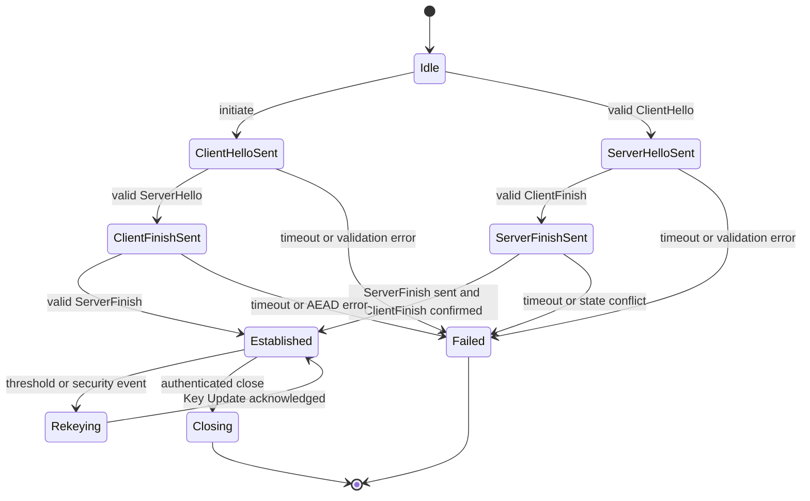

# XSP/1（XS Secure Path Protocol v1）

状态：M2.1 协议、地址发现、候选交换和认证路径迁移已实现  
日期：2026-07-29  
安全状态：未经独立第三方审计，不得描述为生产级安全。

## 1. 目标与非目标

### 1.1 目标

- UDP 上的端到端认证加密三层数据通道；
- 双方节点身份、Network ID、Node ID、虚拟 IP 和协议版本绑定；
- Direct 与 Relay 路径复用相同内层密文；
- 每方向独立密钥、序列和重放窗口；
- 支持路径探测、网络变化、Epoch 更新和完整重握手；
- 未知、畸形、篡改、重放和越权报文安全拒绝。

### 1.2 非目标

- 不兼容 WireGuard、Noise、QUIC、STUN、TURN、ICE 或其他覆盖网络私有协议；
- v1 不支持 0-RTT、会话恢复、自定义业务分片、二层广播或 Exit Node；
- v1 不在内核实现握手、密码学、ACL、NAT 或 Relay；
- 本规范不替代第三方协议和密码学审计。

## 2. 基础编码

- 所有整数为无符号网络字节序；
- 所有固定字节数组按原始字节编码，不使用文本十六进制；
- 所有保留字段发送时为 0，接收时非 0 必须拒绝；
- 长度字段必须在分配内存前验证上限和剩余报文长度；
- v1 单个 UDP datagram 最大 1500 字节，握手凭证固定 200 字节；
- Magic 为 ASCII `XSP1`，字节 `58 53 50 31`；
- Protocol Version 为 `0x01`；
- 未知版本、类型、flag 或扩展不能按 v1 猜测解析。

## 3. 标识

| 标识 | 长度 | 生成者 | 说明 |
|---|---:|---|---|
| Network ID | 16 | Controller CSPRNG | 网络全局唯一随机值 |
| Node ID | 16 | 节点公钥哈希 | `SHA-256("XSP/1 node id v1" || public_key)` 前 16 字节 |
| Session ID | 16 | ServerHello 发送方 CSPRNG | 每次完整握手唯一 |
| Path ID | 4 | Agent | 本地路径标识，不作为身份 |
| Credential Serial | 8 | Controller | 网络内单调或唯一序列 |
| Message ID | 4 | 握手发起方 CSPRNG | 重传去重，不作为密码学 nonce |

## 4. 节点凭证

固定长度：200 字节。

| Offset | Size | Field |
|---:|---:|---|
| 0 | 1 | Credential Version，v1 为 1 |
| 1 | 3 | Reserved，必须为 0 |
| 4 | 16 | Network ID |
| 20 | 16 | Node ID |
| 36 | 32 | Ed25519 Public Key |
| 68 | 4 | Virtual IPv4，网络字节序 |
| 72 | 8 | Credential Serial |
| 80 | 8 | Not Before，Unix seconds |
| 88 | 8 | Not After，Unix seconds |
| 96 | 4 | Role Bitmap |
| 100 | 32 | Tag/Role Set SHA-256 |
| 132 | 4 | Controller Credential Key ID |
| 136 | 64 | Controller Ed25519 Signature |

Controller 签名输入：

```text
"XSP/1 credential v1" || credential[0..136]
```

Role Bitmap 与标签集合通过固定摘要绑定。标签规则如下：

- 标签数量为 `0..32`；
- 每个标签长度为 `1..63` 个 ASCII 字节；
- 首字节必须是小写 `a-z`，其余字节只允许小写字母、数字、`-`、`_`、`.`、`:`、`/`；
- 标签必须唯一；编码前按原始字节升序排序，因此调用方顺序不影响摘要；
- 不接受大小写折叠、Unicode 正规化或重复标签。

Role Set 摘要定义为：

```text
SHA-256(
  "XSP/1 role set v1" ||
  uint32_be(role_bitmap) ||
  uint16_be(tag_count) ||
  for each canonical_tag:
    uint16_be(tag_length) || tag_bytes
)
```

接收方验证签名、Key ID、Network ID、Node ID 与公钥哈希、有效期、吊销序列和目标节点目录。动态 ACL 不直接嵌入凭证，由单独签名配置控制。

## 5. 握手帧

### 5.1 公共头

固定长度：16 字节。

| Offset | Size | Field |
|---:|---:|---|
| 0 | 4 | Magic `XSP1` |
| 4 | 1 | Version = 1 |
| 5 | 1 | Message Type |
| 6 | 2 | Flags，v1 必须为 0 |
| 8 | 4 | Body Length |
| 12 | 4 | Message ID |

握手类型：

| Value | Name |
|---:|---|
| `0x10` | ClientHello |
| `0x11` | ServerHello |
| `0x12` | ClientFinish |
| `0x13` | ServerFinish |

### 5.2 ClientHello

Body Length：389 字节。

| Order | Size | Field |
|---:|---:|---|
| 1 | 16 | Network ID |
| 2 | 16 | Source Node ID |
| 3 | 16 | Destination Node ID |
| 4 | 32 | Client Nonce |
| 5 | 32 | Client X25519 Ephemeral Public Key |
| 6 | 8 | Client Time，Unix seconds |
| 7 | 2 | Credential Length，必须为 200 |
| 8 | 200 | Client Credential |
| 9 | 1 | Suite Count，v1 必须为 1 |
| 10 | 2 | Suite ID，必须为 `0x0001` |
| 11 | 64 | Client Ed25519 Signature |

签名输入：

```text
"XSP/1 client auth v1" ||
client_hello_common_header ||
client_hello_body_without_signature
```

公共头中的 Body Length 仍填写 389，因此签名输入无长度歧义。

### 5.3 ServerHello

Body Length：468 字节。

| Order | Size | Field |
|---:|---:|---|
| 1 | 16 | Network ID |
| 2 | 16 | Source Node ID（Server） |
| 3 | 16 | Destination Node ID（Client） |
| 4 | 32 | Echo Client Nonce |
| 5 | 32 | Server Nonce |
| 6 | 32 | Server X25519 Ephemeral Public Key |
| 7 | 32 | SHA-256(ClientHello Full) |
| 8 | 16 | Session ID |
| 9 | 8 | Server Time，Unix seconds |
| 10 | 2 | Selected Suite ID，必须为 `0x0001` |
| 11 | 2 | Credential Length，必须为 200 |
| 12 | 200 | Server Credential |
| 13 | 64 | Server Ed25519 Signature |

签名输入：

```text
"XSP/1 server auth v1" ||
SHA-256(client_hello_full) ||
server_hello_common_header ||
server_hello_body_without_signature
```

### 5.4 ClientFinish 与 ServerFinish

Body Length：76 字节。

| Order | Size | Field |
|---:|---:|---|
| 1 | 16 | Session ID |
| 2 | 8 | Confirm Sequence，v1 必须为 0 |
| 3 | 2 | Ciphertext Length，v1 必须为 32 |
| 4 | 2 | Reserved，必须为 0 |
| 5 | 32 | Ciphertext |
| 6 | 16 | ChaCha20-Poly1305 Tag |

AAD 为 16 字节公共头加 Body 前 28 字节。ClientFinish 明文为 `hello_transcript_hash`。ServerFinish 明文为：

```text
SHA-256(
  "XSP/1 server finish v1" ||
  client_hello_full || server_hello_full || client_finish_full
)
```

同一 Finish 的网络重传必须逐字节相同，不能在相同 key/nonce 下重新加密不同明文。

## 6. 握手状态机



### 6.1 处理顺序

1. 验证 datagram 最小长度；
2. 验证 Magic、Version、Type、Flags 和 Body Length；
3. 验证 Message ID 和状态是否允许；
4. 验证字段长度、保留位、Network ID 和目标 Node ID；
5. 验证凭证格式、Controller 签名、Node ID、公钥和有效期；
6. 验证节点吊销和网络成员关系；
7. 验证 Ed25519 握手签名；
8. ClientHello 执行 nonce 重放缓存检查；
9. 执行 X25519 并拒绝全零共享结果；
10. 派生 handshake key 并验证双向 Finish；
11. 只有双方 key confirmation 完成后建立数据会话。

v1 不允许跨状态接受消息，不允许将重复 ClientHello 当成新身份。实现可以缓存逐字节相同的 ServerHello 处理 UDP 重传，但缓存有严格 TTL 和容量限制。

## 7. 数据包

固定明文头：96 字节。AEAD Tag：16 字节。

| Offset | Size | Field |
|---:|---:|---|
| 0 | 4 | Magic `XSP1` |
| 4 | 1 | Version = 1 |
| 5 | 1 | Packet Type |
| 6 | 2 | Flags |
| 8 | 2 | Header Length = 96 |
| 10 | 2 | Payload Length，密文长度，不含 Tag |
| 12 | 16 | Network ID |
| 28 | 16 | Source Node ID |
| 44 | 16 | Destination Node ID |
| 60 | 16 | Session ID |
| 76 | 4 | Key Epoch |
| 80 | 8 | Sequence |
| 88 | 4 | Path ID |
| 92 | 4 | Reserved = 0 |
| 96 | N | Ciphertext |
| 96 + N | 16 | AEAD Tag |

UDP payload 总长度必须严格等于 `96 + Payload Length + 16`。整个 96 字节头作为 AAD。

### 7.1 Packet Type

| Value | Name | Encrypted payload |
|---:|---|---|
| `0x01` | Data | 完整 IPv4 包 |
| `0x02` | Keepalive | 空或固定状态摘要 |
| `0x03` | PathChallenge | 8 字节随机 token |
| `0x04` | PathResponse | 原样返回 8 字节 token |
| `0x05` | KeyUpdate | Next Epoch 与确认摘要 |
| `0x06` | KeyUpdateAck | Next Epoch 与确认摘要 |
| `0x07` | Close | 加密关闭码和可选受限原因 |

### 7.2 Flags

| Bit | Name | 规则 |
|---:|---|---|
| `0x0001` | Ack Eliciting | 接收端需要产生受限确认行为 |
| `0x0002` | Control | Payload 使用控制类型结构 |
| `0x0004` | Path Probe | 只允许 PathChallenge/PathResponse |

其他位必须为 0。Relay 路径不写入内层 flag，Direct 与 Relay 的内层 XSP 包保持相同。

## 8. 加密与 nonce

密码套件和 HKDF 见 `CRYPTOGRAPHIC_DESIGN.md`。

```text
nonce = nonce_salt[4] || uint64_be(sequence)
AAD = data_header[0..96]
```

每个方向和 Epoch 独立维护 key、nonce salt、发送序列和 1024 位接收重放窗口。崩溃恢复不能复用旧 key 并重置序列，必须创建新 Session ID 并完整握手。

## 9. 数据包验证

接收端按以下顺序处理：

1. UDP 长度、96 字节最小头和最大 datagram；
2. Magic、Version、Packet Type、Flags、Header Length、Payload Length 和 Reserved；
3. Network ID、Destination Node ID、Session ID 和当前/短期旧 Epoch；
4. 序列是否明显低于窗口或超过实现允许的前瞻上限；
5. 使用完整头作为 AAD 验证 AEAD；
6. AEAD 成功后提交重放窗口；
7. 验证 Source Node ID 与会话身份；
8. Data 包验证 IPv4 version、总长度、源虚拟 IP、目标虚拟 IP、分片策略和接收端 ACL；
9. 只有全部通过后写入 TUN。

错误包默认静默丢弃并增加限速指标。未认证来源不能获得详细错误。

## 10. IPv4 载荷规则

- v1 只接受 IPv4；
- IP Total Length 必须等于解密载荷长度；
- 源地址必须等于凭证/配置绑定的虚拟 IP；
- 目标地址必须属于本网络节点或已批准子网；
- 不接受多播、广播、`0.0.0.0/0` 路由或未批准本地管理网段；
- 首版默认 TUN MTU 1280；
- v1 不实现 XSP 自定义分片；
- 需要通过 PMTU、ICMP 错误和受控 MSS 处理避免黑洞。

## 11. XSD/1 地址映射发现

XSD/1 是与 XSP/1 数据面配套、但不属于 XSP/1 会话包类型的固定长度 UDP 协议。Agent 必须从承载 XSP/1 的同一个 UDP socket 发送请求，使响应中的观察端点包含真实数据面源端口。Magic 为 ASCII `XSD1`，版本为 1。

公共头固定 12 字节：

| Offset | Size | Field |
|---:|---:|---|
| 0 | 4 | Magic `XSD1` |
| 4 | 1 | Version = 1 |
| 5 | 1 | Type：Request = 1，Response = 2 |
| 6 | 2 | Reserved = 0 |
| 8 | 2 | Total Length |
| 10 | 2 | Reserved = 0 |

Request 固定 334 字节：

| Offset | Size | Field |
|---:|---:|---|
| 12 | 16 | Network ID |
| 28 | 16 | Node ID |
| 44 | 16 | Request ID，CSPRNG 且非全零 |
| 60 | 8 | Client Time，Unix seconds |
| 68 | 2 | Credential Length = 200 |
| 70 | 200 | Controller 签名节点凭证 |
| 270 | 64 | 节点 Ed25519 签名 |

请求签名输入：

```text
"XS Nexus discovery request v1" || request[0..270]
```

Response 固定 188 字节：

| Offset | Size | Field |
|---:|---:|---|
| 12 | 16 | Network ID |
| 28 | 16 | Node ID |
| 44 | 16 | Request ID |
| 60 | 8 | Server Time，Unix seconds |
| 68 | 24 | Observed Endpoint |
| 92 | 32 | `SHA-256(request[0..334])` |
| 124 | 64 | Controller Configuration Signing Key 签名 |

观察端点编码固定 24 字节：第 0 字节为地址族 4 或 6；1..3 和 22..23 为 0；4..19 为地址，其中 IPv4 只使用 4..7 且 8..19 必须为 0；20..21 为非零 UDP 端口。响应签名输入为：

```text
"XS Nexus discovery response v1" || response[0..124]
```

双方时间允许最多 300 秒偏差。Controller 只有在请求长度、凭证、节点身份、签名、时间和数据库中的活动凭证状态全部有效时才响应；无效请求静默丢弃。响应小于请求，单来源限制为每分钟 30 个请求，最多跟踪 1024 个来源，因此不能作为匿名放大器。Agent 只接受来自已配置发现端点、匹配精确 Request ID 与请求哈希、时间新鲜且由已信任配置密钥签名的响应。

## 12. 签名候选交换

Agent 通过 Netlink 枚举承载数据面端口的 IPv4、IPv6 地址，并将 XSD/1 观察端点作为 `mapped` 候选。候选种类与优先顺序固定为：

1. `local`：本机直接配置的非 loopback IPv4、ULA 或带 scope 的 link-local IPv6；
2. `public_ipv6`：非 ULA、非 link-local 的全局 IPv6；
3. `mapped`：XSD/1 返回的观察端点；
4. `static`：未来显式管理员配置；
5. `relay`：M2.3 单独定义，不允许由 M2.1 节点广告提交。

每个节点最多发布 16 个候选，其中本地枚举最多 12 个、发现服务最多 8 个。Agent 为候选分配严格递减且唯一的优先级，默认生命周期 10 分钟、每 4 分钟刷新；测试特性只缩短刷新间隔，不改变默认构建。候选广告字段为 schema version、Network ID、Node ID、持久化单调 generation、生成时间、过期时间和候选列表。

广告在已认证 WebSocket 控制连接中发送。节点对精确紧凑 UTF-8 JSON payload 签名：

```text
Ed25519.Sign(
  node_identity_key,
  "XS Nexus candidate advertisement v1" || exact_payload_bytes
)
```

Controller 验证控制连接身份、签名、Network/Node 绑定、generation、时间窗口、严格递减优先级、端点类型、重复项和资源上限，再持久化并重新发布 Controller 签名配置。相同 generation、payload 和签名的重试是幂等的；相同或更低 generation 的不同内容失败关闭。过期候选不进入新配置。节点自身配置的 direct endpoint 与候选可重复；不同节点的活动端点冲突必须拒绝。

## 13. 路径验证与迁移

初始握手按候选优先级选择端点；当前候选在有界重传后仍未建立会话时才转向下一候选，并记录 `handshake_fallback`。配置更新可替换候选列表，但不得无条件丢弃已建立会话。

PathChallenge 和 PathResponse 始终在已认证 XSP 会话内加密，使用当前方向 traffic key、序列、重放窗口和完整 96 字节 AAD。Challenge payload 为 8 字节 CSPRNG token，并设置非零 Path ID 与 Path Probe flag。新 UDP 五元组只有在同一端点返回 AEAD 有效、Path ID 和 token 均匹配的 PathResponse 后才可晋升为活动路径。Agent 只探测优先级高于当前活动路径的候选，使用有界重传和冷却时间；成功时记录 `authenticated_path_probe`。经认证握手或普通 Peer 流量也可证明其来源端点，但未认证源地址变化永远不改变节点身份或活动路径。

## 14. Key Epoch

KeyUpdate payload：

| Size | Field |
|---:|---|
| 4 | Next Epoch，必须等于 Current + 1 |
| 32 | `SHA-256("XSP/1 key update v1" || Session ID || Current Epoch || Next Epoch)` |

KeyUpdate 使用当前发送 Epoch 加密。接收方验证后只安装该方向的下一个接收 Epoch，并使用自身当前发送 Epoch 返回 KeyUpdateAck；发起方收到匹配确认后才切换该方向的发送 Epoch。相反方向独立轮换。生产 Agent 在单方向发送 `2^20` 个数据包或运行 1 小时后触发轮换，旧接收 Epoch 最多保留 30 秒和 1024 个乱序包。状态冲突、跳跃 Epoch、确认重试耗尽后的持续异常或计数不确定触发完整重握手。

## 15. 关闭

已认证会话使用加密 Close。关闭码：

| Code | Meaning |
|---:|---|
| 1 | Normal |
| 2 | Credential Revoked |
| 3 | Policy Changed |
| 4 | Rekey Required |
| 5 | Protocol Violation |
| 6 | Resource Limit |

公网未认证错误不返回内部原因。关闭后密钥和重放状态清零，Session ID 在本地短期 tombstone 中保留以拒绝延迟包。

## 16. Relay 边界

Relay 使用独立的未来 `XSR/1` envelope，至少包含认证 Relay Session、目的转发槽、长度、序列和 Relay 会话认证 Tag。Relay envelope 的 payload 是完整 XSP/1 UDP payload。Relay 不改变、解密或重新加密内层 XSP/1 包，也不能代表目标节点完成握手。

`XSR/1` 具体格式在 M2.3 前单独规范和威胁评审；本文件不预先声明其安全完成。

## 17. 限制与资源上限

实现必须配置并测试：

- 每来源未完成握手数；
- 全局未完成握手数；
- ClientHello nonce 缓存容量和 TTL；
- 单节点会话数；
- 每 Session 接收队列；
- 每 datagram 和解密载荷最大长度；
- 每秒签名验证和错误指标上限；
- 每节点候选、发现端点、广告字节和 generation 状态；
- 每来源发现请求速率及全局来源跟踪容量；
- 每 Peer 握手候选重试、PathChallenge 重试和冷却状态；
- Relay 会话、带宽、队列和空闲超时。

收到小型未认证请求时不得产生更大的响应。

## 18. 版本和兼容性

- v1 固定密码套件 `0x0001`；
- 版本和套件进入双方签名 transcript；
- 未知版本不能回退到 v1；
- 同版本同 Message ID 的重传必须逐字节一致；
- 同 Session ID 下字段语义不能重新解释；
- 未来扩展使用新版本或明确已认证扩展，不占用保留字段偷渡语义。

## 19. 测试向量和 Fuzz

仓库锁定以下 canonical 编码与 SHA-256 向量：

```text
tests/vectors/xsp1/data-header-v1.json
tests/vectors/xsp1/credential-v1.json
tests/vectors/xsp1/session-v1.json
tests/vectors/xsp1/discovery-v1.json
```

生成器与有效凭证 Fuzz corpus：

```text
scripts/generate-xsp1-vectors.py
crates/protocol/examples/generate_credential_vector.rs
crates/protocol/examples/generate_session_vector.rs
crates/protocol/examples/generate_discovery_vector.rs
fuzz/corpus/credential/valid-v1.bin
fuzz/corpus/handshake/*.bin
fuzz/corpus/data/*.bin
fuzz/corpus/discovery/*.bin
```

凭证向量固定 Ed25519 签名、公钥、Node ID、Role Set 摘要、Key ID 和完整 200 字节编码。Rust 单元测试验证向量签名，并逐字节篡改 200 个位置确认全部拒绝；规范校验器同时验证长度、字段、哈希和 corpus 一致性。

M1.3 和 M2.1 已锁定以下自动化证据：

- `crates/protocol/tests/primitives.rs` 验证 RFC 7748 X25519、RFC 5869 HKDF-SHA-256 和 RFC 8439 ChaCha20-Poly1305 向量；
- `crates/protocol/tests/session.rs` 验证双方签名、Network/Node/Virtual IP/版本/套件/Session transcript 绑定、双向 Finish、Data AEAD、AAD、虚拟源地址、重放窗口、Epoch 乱序和旧 Epoch 退休；
- `tests/vectors/xsp1/session-v1.json` 固定四个握手消息、应用数据包、完整数据头和 SHA-256，任一 HKDF 域分离标签、编码或密钥方向变化都会改变向量；
- `fuzz/corpus/handshake` 和 `fuzz/corpus/data` 包含有效消息以及 Magic、版本、类型、flag、长度、保留字段、截断、尾随字节和意外状态种子；
- X25519 全零结果、签名/Finish/Tag 篡改、非规范编码、重放边界和 Epoch 状态冲突均以失败关闭测试覆盖。
- `tests/vectors/xsp1/discovery-v1.json` 固定 XSD/1 请求、响应、签名、观察端点和 SHA-256；`fuzz/corpus/discovery` 覆盖有效请求/响应、篡改、截断、时间和请求绑定失败；
- Controller/Agent 集成测试覆盖活动凭证检查、响应小于请求、签名候选发布、幂等重试、generation 冲突和动态配置应用；
- 隔离 namespace 测试覆盖首选候选不可达后的握手回退，以及已建立会话对更高优先级路径的 AEAD Challenge/Response 晋升和双向业务连续性。

这些证据覆盖协议库、真实 Controller/PostgreSQL 和隔离 Linux namespace 中的 Agent UDP/TUN 链路；持续 Fuzz、真实公网/NAT 行为矩阵、Relay 边界和独立第三方审计仍是后续强制验收。

任何协议字段或标签变化都必须更新本规范、密码学设计、威胁模型、测试向量和 Fuzz corpus。
